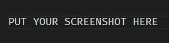

# Url Shortener

## Features
[ ] View the optimal layout for the site depending on their device's screen size

[ ] Shorten any valid URL

[ ] See a list of their shortened links, even after refreshing the browser

[ ] Copy the shortened link to their clipboard in a single click

[ ] Receive an error message when the form is submitted if: The input field is empty

[ ] Fully responsive

Open [Live Demo](<the link>) to view it in action.

## After Cloning

run the script `npm i` in the project directory to install all the required packages

## Available Scripts

In the project directory, you can run:

### `yarn start` `npm start`

Runs the app in the development mode.\
Open [http://localhost:3000](http://localhost:3000) to view it in the browser.

The page will reload if you make edits.\
You will also see any lint errors in the console.
